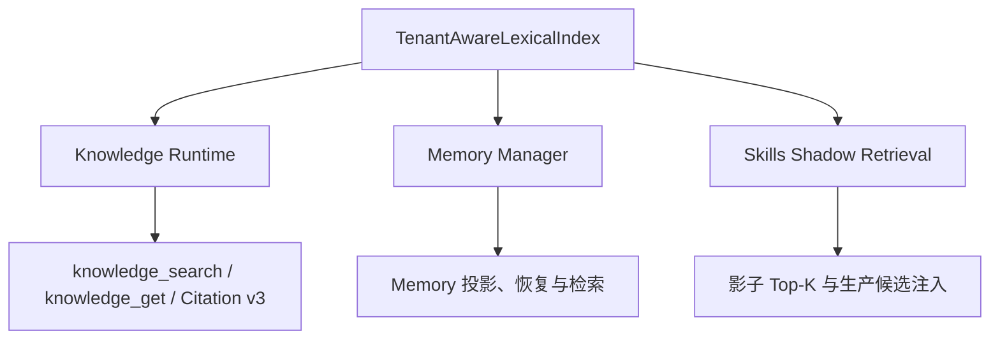

# SmartAssistant + SAS 重写项目：当前会话上下文与工程交接报告

首次生成：2026-07-30 20:39:53 +08:00  
本次更新：2026-07-30 23:45:06 +08:00  
SmartAssistant：`C:\Users\UnlimitedPower\Documents\桌面智能助手\SmartAssistant`  
SAS 只读参考：`D:\SuperAgentSystem`

## 1. 当前结论

项目尚未完成，不能宣称已经通过最终验收。

截至本次更新，可以由当前源码、命令输出和真实数据复核的结论如下：

1. Knowledge 后端核心已形成当前有效的严格超越证据。最新临时报告为 schema 3，53/53 门禁通过；在完整 CMRC 2018 开发集上，检索质量、Mean/P50/P95 查询延迟和建库中位数均严格优于 SmartAssistant 原版适配器。
2. 本轮 Knowledge 建库优化后的完整 Python 回归已通过：`774 passed, 38 skipped, 1 warning, 16 subtests passed in 95.88s`。Desktop 生产构建、依赖闭包、UTF-8、乱码、Python 编译、JavaScript 语法和许可证打包配置检查也已通过。
3. 最新 Knowledge 报告仍命名为 `cmrc2018-knowledge-comparison-optimized.json`；正式文件 `cmrc2018-knowledge-comparison.json` 还是旧 schema 2 报告。正式证据晋升尚未完成。
4. Retrieval 的 9/9 报告和 Memory 的 14/14 报告都早于共享词法索引的本轮修改，当前实现指纹与报告不一致。它们只能作为历史结果，不能继续证明当前源码通过对应性能门禁。
5. Agent Loop、Knowledge/Memory 治理、Citation v3、技能候选治理、影子检索和客户验收协议已有代码与测试基础；但 Web/Desktop Citation 点击闭环、Memory 原版同协议对照、真实技能金标、生产 Top-K 和真实客户验收均未完成。
6. SmartAssistant 仍位于一个 `No commits yet on master` 的父 Git 仓库中，整个项目没有可复现提交基线。这是当前交付和技术尽调的发布阻断项。

当前工程状态应定义为：**Knowledge 后端当前数据门禁和项目回归已通过；项目级证据整理、共享索引下游重测、客户端闭环、Git 基线、真实技能评测与客户验收仍未完成。**

## 2. 当前会话上下文

### 2.1 业务背景

- 原 `D:\SuperAgentSystem` 在开发、证据可信度和演示稳定性上存在较多问题，暂时不适合作为潜在投资人演示版本。
- 当前路线是以 SmartAssistant 的可运行 Harness 和 Agent Loop 为基础，对 SAS 中确有价值且能由源码复核的模块进行代码级重写与受控融合。
- 用户已明确指出 SAS 的 Memory 和 Knowledge Platform(KP) 存在较大问题，Claude 生成的历史“证据清单”不可信。
- 自此只接受当前源码、真实命令输出、真实数据集、报告哈希和实现 SHA-256；没有可复现实证的功能一律视为未完成。
- 用户提供的外部“工作手册”方向包含 AutoSkill、EvoSkill、MemSkill、CoEvoSkills 和 SE-Agent。当前决定是逐步吸收其可验证机制，不在缺少金标和客户验收时自动发布 Skill。
- 用户允许并要求把可并行工作交给多个子代理。本轮并行审计用于核验完成证据、共享索引影响和未完成模块，最终结论仍由主任务用本地命令复核。

### 2.2 会话决策轨迹

1. 拉取并阅读 SmartAssistant，定位 Agent Loop、Tools、Prompt、Memory、Knowledge 和 Skills。
2. 由“理解开源项目”转为“以 SmartAssistant 为底座，对 SmartAssistant + SAS 做代码级重写”。
3. 因 SAS/Claude 历史证据不可信，重新建立证据驱动(Evidence-driven)基线。
4. 完成受治理记忆(Governed Memory)、受治理知识(Governed Knowledge)、技能治理和 Citation v3 的阶段性实现。
5. 在真实 CMRC 2018 数据上发现 Knowledge 建库性能不满足严格超越后，完成剖析、集合化核验、批量事实写入和独立 ABBA 建库基准改造。
6. 最新 Knowledge 报告已通过 53/53 门禁，但修复影响分析(Fix Impact Analysis)发现 Retrieval、Memory 和 Skills 共用 `TenantAwareLexicalIndex`，因此旧 Retrieval/Memory 报告失效，必须重跑。
7. 当前节点转入证据整理、下游重测、客户端 Citation 闭环和可复现基线建设。

### 2.3 合规边界

- SmartAssistant 原始 ZIP SHA-256：`f121b65e04e0cf7b008e6404f7a9e3ce11cee8457ed58252b9a57b20366bcf58`。
- `LICENSE` SHA-256：`d72f9e8cfa805e7dd9edc73dda0cb150a715f4eb5b439ed597664639ffbf5dfc`。
- `NOTICE` SHA-256：`b967fca85187c71da42500f97fc9654dc938a25dbbd9828ef3d9db684f4569f7`。
- `desktop/package.json` 的 `extraResources` 已配置打包 `LICENSE` 和 `NOTICE`，本轮检查通过。
- 可以重构产品名称、界面、架构和业务能力，但不能删除许可要求的版权与许可文本，也不能向投资人或技术尽调团队虚假陈述为完全无上游来源的原创项目。

## 3. 项目目标与完成定义

持续目标是：

> 保持 SmartAssistant 核心能力和可运行性；被改进模块至少与原版持平，声明改进的指标必须由真实数据证明严格超越；最终通过目标客户测试。

| 编号 | 验收条件 | 所需证据 | 当前状态 |
|---|---|---|---|
| G1 | SmartAssistant 核心能力不退化 | 原版能力矩阵、同场景回归、完整 CI、Desktop 构建 | 部分完成；当前回归通过，但缺完整原版能力矩阵和 Git 基线 |
| G2 | 重写模块至少与原版持平 | 同数据、同协议、同环境、当前指纹对照 | Knowledge 后端通过；Retrieval/Memory 当前报告待重跑 |
| G3 | 声明改进的模块严格超越 | 真实数据、三轮交错、严格不等式门禁 | Knowledge 后端通过；其他模块未形成当前完整证据 |
| G4 | 安全与治理不退化 | 租户/用户/会话隔离、撤销、篡改、竞态和恢复负例 | 本地 Memory/Knowledge/Skills 局部通过；企业边界未完成 |
| G5 | 产品消费闭环 | Web/API/Desktop 可按当前身份解析 Citation、失败关闭 | 未完成 |
| G6 | 目标客户验收通过 | 客户任务包、固定执行器、独立 Judge、签名结果 | 未完成，缺 11 项机器可读输入及真实客户任务包 |

只有 G1-G6 全部具备与当前提交绑定的可复现实证，项目才可以标记为完成。

## 4. 工作区和基线状态

### 4.1 SmartAssistant

- 父仓库状态：`## No commits yet on master`。
- SmartAssistant 没有独立 Git 历史，当前源码无法绑定到 commit，只能暂时依赖文件和报告 SHA-256。
- `.research` 虚拟环境也位于父工作区内且未被提交边界隔离，后续建立基线时必须排除依赖、缓存、数据库、日志和密钥。

### 4.2 SAS

2026-07-30 只读复核结果：

- 远端：`https://github.com/Gof-Boy-By-NUAA/SuperAgentSystem.git`
- 当前 HEAD：`ad49f51abc8653a8b5b7a80be3ca911f0d3bef9e`
- 相对 `origin/main`：ahead 0，behind 2。
- 工作树：14 个已修改项、16 个未跟踪项，共 30 项变化。

因此 SAS 只能作为需求和源码线索，不是可复现基线；其历史文档和证据不能直接继承。

### 4.3 真实评测数据

- 数据集：CMRC 2018 官方开发集 `cmrc2018_dev`。
- 上游提交：`c0eb1b6ba219847457e6af3180da722bbeb656af`。
- 数据 SHA-256：`5cfe4414c28a8ecbb51670f78c0dc7d1049f286c2d5769b52f1f94bcc0752cf1`。
- 规模：848 个文档、3219 个问题。
- 三轮查询：每个引擎 9657 个原始延迟样本。
- 环境：Python 3.11.8，SQLite 3.43.1，Windows。

## 5. 已完成工作和当前证据

### 5.1 Knowledge 建库与检索优化

本轮完成的源码改动：

- `agent/knowledge/parser.py`：仅在实际章节和证据边界计算 UTF-8 偏移，消除逐字符重复编码。
- `agent/retrieval/lexical.py`：`matches_tenant()` 改为单次有序读取后对 12 个映射字段做精确比较；保留 `docsize` 覆盖和 FTS5 `integrity-check rank=1`。
- `agent/retrieval/lexical.py`：单租户初始建库使用事务内 FTS 全量重建；多租户更新继续走隔离的增量路径。
- `agent/knowledge/repository.py`：新增全新文档原子批写，以及批次派生任务 `knowledge_derivative_batches`；更新、冲突和重放仍保留原逐文档语义。
- `agent/knowledge/runtime.py`：满足无显式文档 ID、无投影、无批内依赖时使用批写快路径；事实和 FTS 可并行准备，失败时仍由事实源回查关闭结果。
- `benchmarks/knowledge/evaluate.py`：使用 `write_batch(..., sync_derivatives=True)`，保存每轮全部查询延迟并提供独立建库计时入口。
- `benchmarks/knowledge/compare.py`：报告升级为 schema 3；建库采用预热后的三轮平衡 ABBA，每引擎六个独立新库样本；新增严格门禁 `latency.index_latency_ms.strict_improvement`。

当前有效证据：

- 临时报告：`benchmarks/results/cmrc2018-knowledge-comparison-optimized.json`
- 报告 SHA-256：`9dc5e8c2369416dd8508fbb3579ac6a99e8aa5e759dcd7bfb3a62d91af28b8e0`
- 报告 schema：3。
- 结果：`passed=true`、`official_full_dataset_gate=true`、53/53 门禁通过。
- 当前 Knowledge 实现指纹：`feccbaf17067851ecf4faa1288af4ba5225e2e7736a2a976953500f32d69466f`，与报告一致。
- 当前 Knowledge 比较器指纹：`81613d33725615c9503789446a7ae9bb825d7f579f6e005228ed18c59d92f55f`，与报告一致。

| 指标 | SmartAssistant 原版 | 当前 Knowledge | 结论 |
|---|---:|---:|---|
| Recall@1 | 0.1121 | 0.8984 | 严格提升 |
| Recall@5 | 0.1351 | 0.9444 | 严格提升 |
| Recall@10 | 0.1417 | 0.9487 | 严格提升 |
| MRR@10 | 0.1210 | 0.9184 | 严格提升 |
| 空结果率 | 0.7897 | 0.0146 | 严格降低 |
| 查询 Mean | 3.6478 ms | 2.4133 ms | 严格降低 |
| 查询 P50 | 2.4533 ms | 1.6318 ms | 严格降低 |
| 查询 P95 | 10.2230 ms | 7.4117 ms | 严格降低 |
| 建库中位数 | 1006.1167 ms | 824.0378 ms | 严格降低约 18.1% |
| Citation 解析准确率 | 0 | 1.0 | 零容忍门禁通过 |
| 来源声明绑定准确率 | 0 | 1.0 | 零容忍门禁通过 |

建库六个独立样本：

```text
legacy:   1379.2134, 1045.6089, 654.1779, 938.7730, 966.6245, 1415.2961 ms
governed: 1259.4817, 1175.9747, 716.2470, 769.9356, 878.1400, 704.2056 ms
```

当前门禁使用固定协议下六样本中位数；当前实现三轮胜出 2/3，相邻配对胜出 4/6。Windows 调度仍有波动，因此报告必须绑定机器、协议、全部样本和实现指纹，不能只引用单次最快值。

### 5.2 Citation v3 与 Knowledge 治理

已经实现：

- 不可变版本、撤销、回滚、权限过滤、派生任务和启动恢复。
- Citation v3 规范 URI 绑定 document、version、section、evidence、UTF-8 字节范围、正文哈希、引文哈希和 `source_ref_hash`。
- `resolve_verified_citation()` 按当前身份重新校验租户、用户、会话、敏感级别、active 版本和引用完整性。
- v1/v2、缺字段、截断、参数乱序、重复/未知参数、来源/正文/引文篡改均失败关闭(Fail Closed)。
- `knowledge_search`、`knowledge_get`、Agent Loop 工具结果、Web SSE 和历史文本可完整传输 v3 URI。
- 事实提交失败后产生的孤立 posting 不可检索；重启恢复会重建并清理。

当前 53 项 Knowledge 门禁覆盖真实回读、权限、撤销、来源篡改、引用解析、检索质量、查询延迟和建库延迟。后端协议已通过，但 Web/Desktop 用户点击与展示仍未完成，因此不能把“后端通过”写成“产品闭环完成”。

### 5.3 Memory 治理基础

已经实现：

- 租户、用户、会话、作用域和敏感级别治理。
- 幂等写入、不可变版本、撤销、回滚和审计。
- 事实与派生任务原子提交的事务发件箱(Transactional Outbox)。
- 启动恢复、投影完整性、索引完整性和撤销零污染。
- 统一锁顺序和真实双线程首次初始化死锁测试。

历史报告 `benchmarks/results/cmrc2018-memory-outbox.json` 为 14/14 通过，但报告指纹是 `831295817ee303781ad82f1329c68b36b5c85457c7ca580dee9fd65e3a978924`，当前指纹是 `317475504225513aacd42c23214862d91a30b9c057f7d5627917c8bf396a767f`。两者不一致，因此该报告已失效；并且历史报告本身没有 SmartAssistant 原版同协议对照。

结论：Memory 的代码和回归测试基础存在，但“当前数据门禁通过”和“相对原版严格超越”都尚未成立。

### 5.4 Retrieval 历史结果

历史 `benchmarks/results/cmrc2018-comparison.json` 为 9/9 通过，记录的候选实现指纹为 `d6d81863ede268bb917c22f8d63fec4d54dba2a8a6c356822e3c263554992815`。当前共享词法引擎指纹为 `fe6c1d8adfe8b8aa2d38b596ab20b9ec34b6468004eb4502a30c5ae1aeb68dba`。

比较器指纹仍为 `eb7fa53dc95cbe322f794a11b1cbd4603f7b92e92c83490555512c06700d3ada`，但候选实现已经变化。历史 9/9 结果只能证明当时源码，不能证明当前 Retrieval；必须重跑完整三轮比较。

### 5.5 Skills 和外部工作手册基础

已经实现：

- 结构化 Skill 候选、版本、来源、角色分离和审计。
- 固定配对套件(Paired Suite)和 active-only 租户化影子索引。
- 候选、拒绝和 superseded 版本不会进入生产候选集。
- 投影内容哈希、模型兼容、租户和权限二次复核。
- 后台演化只能提出 inactive candidate，不能自动发布。
- 生产 Top-K 注入代码存在，但 `skill_retrieval_injection_enabled=False`，缺失配置时也默认关闭。

当前真实技能选择数据门禁为 `blocked_invalid_dataset`，原因是来源证明不完整。公开 Issue 标题只能作为银标(Silver Label)，不能替代人工金标或客户任务成功率。因此生产 Top-K 仍必须关闭。

### 5.6 客户验收框架

已经实现客户控制的签名清单、固定 Skill 版本、执行器版本、运行目录和独立验证协议。合成协议测试证明框架能运行，不证明真实客户效果。

当前报告：

- 文件：`benchmarks/results/customer-skill-acceptance.json`
- SHA-256：`35c26d30c08f48fae66290100811dc5e2ce60257bb3d67949e2e197d6ff04dbc`
- 状态：`pending_customer_inputs`
- `passed=false`

### 5.7 当前项目级验证

本轮在 Knowledge 性能源码修改完成后重新执行：

| 检查 | 当前结果 |
|---|---|
| Python 全量回归 | `774 passed, 38 skipped, 1 warning, 16 subtests passed in 95.88s` |
| Knowledge/共享索引影响集 | `82 passed, 16 subtests passed` |
| `pip check` | `No broken requirements found.` |
| Web 运行依赖导入 | `web dependency imports: OK` |
| `compileall` | 通过 |
| Desktop backend spec | `desktop backend spec syntax: OK` |
| 严格 UTF-8 与替换字符扫描 | 通过 |
| 自有 Web/Desktop JavaScript 语法 | 7/7 文件通过 |
| Desktop `npm.cmd run build` | 通过；Vite 2100 modules，TypeScript 主进程编译通过 |
| `LICENSE`/`NOTICE` 打包配置 | 通过 |

非阻断警告：

- Python 有 1 个 `setDaemon()` 弃用警告。
- Desktop 构建提示两个 vendor font 路径在构建时不存在，并提示主 JavaScript chunk 大于 500 kB。
- 第一次沙箱内 Desktop 构建因构建器读取工作区祖先目录被拒绝而失败；相同命令在沙箱外通过，确认是执行环境权限限制，不是源码编译失败。

## 6. 修复影响分析

本轮关键共享调用链如下：



影响结论：

1. Knowledge：当前实现指纹和 schema 3 报告一致，53/53 数据门禁和完整回归通过。
2. Retrieval：共享 `lexical.py` 变化导致旧候选指纹漂移，必须重跑 9 项真实数据门禁。
3. Memory：报告指纹包含共享 `lexical.py`，当前指纹漂移，必须重跑事务发件箱、恢复和污染门禁；还要补原版同协议对照。
4. Skills：影子检索也使用共享索引。单元回归已通过，但真实技能数据本身无效，因此不能用代码测试替代数据门禁。
5. 数据结构兼容：Knowledge 新增 `knowledge_derivative_batches`；快路径仅用于全新、无批内依赖的文档。更新、重放、冲突、投影和多租户场景回退原语义。
6. 并发与失败：事实和 FTS 可以并行准备，但事实源仍是最终权威；事实提交失败后的 posting 不可返回，重启全量重建可清理孤立数据。
7. 持久化：优化没有通过关闭事务、`fsync`、权限复核、事实源回查或撤销清理换取性能。

## 7. 未完成模块与实施方法

### P0-1：整理并固化当前证据

**缺口**

- 当前有效 Knowledge 报告仍使用 `-optimized` 临时文件名。
- 正式 Knowledge 报告是已过期的 schema 2 文件。
- Retrieval 和 Memory 报告均与当前实现指纹不匹配。

**实施步骤**

1. 将旧 schema 2 正式报告移入明确的 `superseded` 归档，保留原 SHA-256，不把失败或过期结果混入当前证据。
2. 将 schema 3 通过报告按字节晋升为 `cmrc2018-knowledge-comparison.json`，复核晋升前后 SHA-256 都为 `9dc5e8...`。
3. 用当前指纹重跑 Retrieval 三轮完整 CMRC 2018 比较，要求所有严格门禁通过。
4. 用当前指纹重跑 Memory 14 项事务发件箱和恢复门禁。
5. 生成一份机器可读 evidence manifest，绑定报告路径、SHA-256、数据哈希、Python/SQLite 环境和实现指纹。

**完成门禁**

- 正式目录中只有一份被声明为 current 的报告。
- 每份 current 报告的实现指纹可由当前源码重新计算并一致。
- 任何过期报告都显式标记 `superseded`，不能被自动汇总为通过。

### P0-2：建立可复现 Git 基线

**缺口**

SmartAssistant 没有独立提交，无法证明某份报告对应哪一份完整源码。

**实施步骤**

1. 决定 SmartAssistant 使用独立仓库还是父仓库子目录。
2. 增加忽略规则，排除 `.research`、`node_modules`、`dist`、缓存、临时数据库、日志和密钥。
3. 生成受控文件 SHA-256 清单，记录原始 ZIP、`LICENSE`、`NOTICE` 和当前证据报告。
4. 建立“上游基线 + 重写变更”的第一个可审计提交，保留上游归属。
5. 后续报告同时绑定 Git commit、数据集哈希、引擎指纹和比较器指纹。

**完成门禁**

- 从干净提交可安装依赖、重跑 CI 并重算相同实现指纹。
- 工作树中的本地运行产物全部可解释且不进入版本库。

### P0-3：目标客户验收

**缺口**

当前缺少 11 项机器可读输入：

```text
executor_id
executor_json
executor_version
manifest_sha256
package_root
run_root
skill_content_sha256
skill_id
skill_version
skills_db
tenant_id
```

同时缺少客户实际任务、预期结果、禁止行为、固定环境、独立 Judge 和客户签署结论。

**实施步骤**

1. 与目标客户冻结功能、质量、延迟、安全和失败判据。
2. 生成只读验收包和逐文件 SHA-256，固定执行器、Skill、模型、工具与环境版本。
3. 在隔离 `run_root` 中执行无 Skill、固定 Skill、候选能力三组对照。
4. 使用独立 Judge 或确定性 Oracle，禁止被测 Agent 自己判分。
5. 保存完整日志、实现 commit、环境和签名报告，由客户签署。

**完成门禁**

- 11 项输入全部存在并通过哈希复算。
- 任务集来自真实客户，不是内部合成夹具。
- 报告 `passed=true`，且独立验证器可重新计算。

### P1-1：Web/Desktop Citation 消费闭环

**缺口**

- 后端工具可以生成并解析 Citation v3，但 Web/Desktop 没有按当前身份调用的专用 Citation resolve API 和点击组件。
- `desktop/src/main/index.ts` 仍有通用 `shell.openExternal(url)`；必须证明 `knowledge://` 永远不会进入该路径。
- 历史会话中的 v1/v2 URI 缺少失效展示和重新检索交互。

**实施步骤**

1. 增加认证的 Citation resolve/read API，服务端重新执行租户、用户、会话、敏感级别、active 状态和哈希校验。
2. Web/Desktop 增加专用 Citation 组件；拦截 `knowledge://`，展示来源、版本、引文和失效原因。
3. 禁止 Desktop 将 `knowledge://` 交给 `shell.openExternal()` 或操作系统协议处理器。
4. v1/v2 不做静默升级；只能重新检索生成新的 v3 URI。
5. 增加跨租户、跨用户、跨会话、撤销、更新、篡改、历史恢复和外部协议拦截的端到端测试(E2E)。

**完成门禁**

- Web 和 Desktop 均能用当前身份安全打开 v3 引用。
- 未授权、失效和旧版本引用确定性失败关闭。
- 测试证明 `knowledge://` 不会传给系统外部打开接口。

### P1-2：Memory 原版同协议对照

**缺口**

现有 Memory 只有治理版固定阈值历史报告，没有 SmartAssistant 原版同协议基线；当前历史报告又已指纹漂移。

**实施步骤**

1. 冻结 SmartAssistant 原版 Memory 写入、检索、冷启动和恢复适配器及 AST 指纹。
2. 使用相同 CMRC 文档、查询、选择协议和环境运行原版/治理版。
3. 测量写入 P50/P95、冷启动、恢复吞吐、Recall/MRR、查询 P95 和存储体积。
4. 治理版额外执行租户隔离、撤销污染、投影一致性和崩溃恢复。
5. 三轮交错执行并拒绝实现指纹漂移。

**完成门禁**

- 核心用户路径至少持平。
- 声明改进的指标严格提升。
- 安全和一致性负例零泄漏、零撤销污染。

### P1-3：真实技能选择数据与生产 Top-K

**缺口**

当前技能数据报告为：

```text
status=blocked_invalid_dataset
passed=false
metrics=null
error=source.provenance_complete 缺失
```

**实施步骤**

1. 重建逐条来源归档，保存 HTTP 状态、Date、ETag、抓取时间、原始响应和 SHA-256。
2. 修复快照时间早于样本 `updated_at` 的时序问题，禁止修改时间或标签伪造通过。
3. 由独立人员或客户标注设计集、评测集、期望 Skill、禁止 Skill 和无 Skill 负例。
4. 比较全量元数据、影子 Top-K 和固定候选注入三组的成功率、错误注入率、token 和 P95。
5. 仅在客户金标和签名验收均通过后申请小流量启用生产注入。

**完成门禁**

- `provenance_complete=true` 且来源可复算。
- 金标独立于检索实现。
- 生产报告绑定当前实现指纹并通过，默认关闭状态才可受控变更。

### P1-4：完整 Skill 演化闭环

当前仅有受治理候选和验证基础，尚缺：

- AutoSkill 的已验证混合检索；
- EvoSkill 的真实任务进化收益；
- CoEvoSkills 的真实客户 Oracle；
- MemSkill 的奖励驱动 Controller；
- SE-Agent 的同任务多轨迹隔离、融合和副作用安全提交。

实施原则：候选生成、验证、发布保持角色分离；所有自动产物只能进入 candidate/merge proposal/reject proposal，不能自动 active。发布前重新核验来源、模型兼容、权限和环境；多轨迹副作用必须隔离，只有选中轨迹可事务化提交。

### P2-1：Knowledge 长期产品能力

未完成能力：知识审查与批量晋升、实体去重与图谱治理、规则抽取与重验证、附件和非 Markdown 摄取、复合外键 schema 升级、稳定外部 API 与弃用策略。

实施方法：先定义客户需求和数据契约，再为每项能力建立人工标注集、消融实验、权限负例和来源撤销传播测试；不能因为 SAS 有同名模块就直接迁移或宣称完成。

### P2-2：企业身份和安全基础设施

未完成能力：企业身份提供方(IdP)、组织角色同步、令牌验证、静态加密、密钥轮换、备份恢复、多机协调、审计归档和告警。

实施方法：先完成威胁模型和身份信任边界，再选定 IdP/KMS；验收必须使用真实签发令牌、越权负例和密钥生命周期演练，不能把本地 `IdentityContext` 当作企业认证完成证据。

### P2-3：投资演示与产品化

未完成能力：稳定客户演示脚本、固定真实样例、错误/空状态/恢复体验、离线模式、安装升级回滚、崩溃日志、数据迁移演练和与证据逐项对应的尽调材料。

实施方法：以可运行产品和真实证据为中心。对外材料应准确写明“基于 SmartAssistant 的重写与扩展”、当前自研模块、上游许可证和可复核性能报告。

## 8. 推荐执行顺序

1. 归档旧 schema 2 Knowledge 报告，晋升当前 schema 3 报告并生成 evidence manifest。
2. 在下一次源码修改前建立可复现 Git 基线。
3. 重跑当前 Retrieval 三轮真实比较和 Memory 14 项门禁，随后实现 Memory 原版同协议对照。
4. 实现身份化 Citation resolve API、Web/Desktop 点击组件和 `knowledge://` 外部打开拦截。
5. 重建技能来源数据和人工金标；生产 Top-K 继续默认关闭。
6. 固化安装、演示、恢复和尽调材料。
7. 收齐客户验收输入，执行并签署真实客户测试。
8. 最后按客户价值实现企业 IdP/KMS、Knowledge 图谱/规则和完整 Skill 演化闭环。

下一节点的建议输出是：**当前证据固化 + Retrieval/Memory 下游重测**。原因是 Knowledge 优化已改变共享词法实现；若不先关闭指纹漂移，后续任何“项目整体严格超越”表述都没有可复现依据。

## 9. 禁止的错误完成方式

- 不采信或复制 SAS/Claude 历史“证据清单”作为完成证明。
- 不把历史报告用于当前指纹不一致的源码。
- 不使用合成夹具替代真实客户验收。
- 不修改数据时间、标签、哈希或期望值绕过失败门禁。
- 不在技能金标和客户验收前启用生产 Top-K。
- 不通过关闭事务、`fsync`、权限复核、事实源回查或撤销清理换取性能数字。
- 不删除 MIT `LICENSE`、`NOTICE` 或上游归属，不伪装成完全无上游来源的原创项目。
- 不把单元测试通过、代码文件存在、UI 演示或计划文档等同于项目完成。

## 10. 关键证据文件

- `benchmarks/results/cmrc2018-knowledge-comparison-optimized.json`：当前有效 Knowledge schema 3 报告。
- `benchmarks/results/cmrc2018-knowledge-comparison.json`：旧 schema 2 报告，待归档/替换。
- `benchmarks/results/cmrc2018-comparison.json`：历史 Retrieval 报告，当前实现指纹已漂移。
- `benchmarks/results/cmrc2018-memory-outbox.json`：历史 Memory 报告，当前实现指纹已漂移。
- `benchmarks/results/customer-skill-acceptance.json`：客户输入待补。
- `docs/rewrite/sas-capability-traceability.md`
- `docs/rewrite/external-skill-evolution-assessment.md`
- `docs/rewrite/skill-shadow-retrieval.md`
- `docs/rewrite/skill-production-injection.md`
- `docs/rewrite/customer-controlled-skill-acceptance.md`
- `.github/workflows/test-full.yml`
- `LICENSE`
- `NOTICE`

本报告记录 2026-07-30 23:45:06 +08:00 的工作区状态。后续任何会进入实现指纹的源码变化，都会使对应性能报告失效；必须重新运行相关真实数据门禁并更新本报告。
